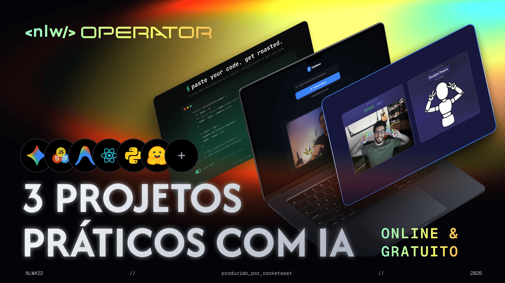

# <nlw/> OPERATOR

Evento online entre os dias 12/03/2026 e 16/03/2026

## Trilha Iniciante

Aplicação web capaz de gerar cortes virais automaticamente a partir de vídeos longos.
 
Desenvolva a integração com Cloudinary e Gemini para analisar transcrições e identificar os momentos mais impactantes, e construa uma interface moderna que exibe o clipe selecionado em tempo real.

## Tecnologias

- HTML
- CSS (TailWind) **estilizado via IA**
- Javascript
- Gemini API
- Cloudinary

### Links de Referêcia

https://cloudinary.com/documentation/upload_widget
https://ai.google.dev/
https://tailwindcss.com/
https://gsap.com/
